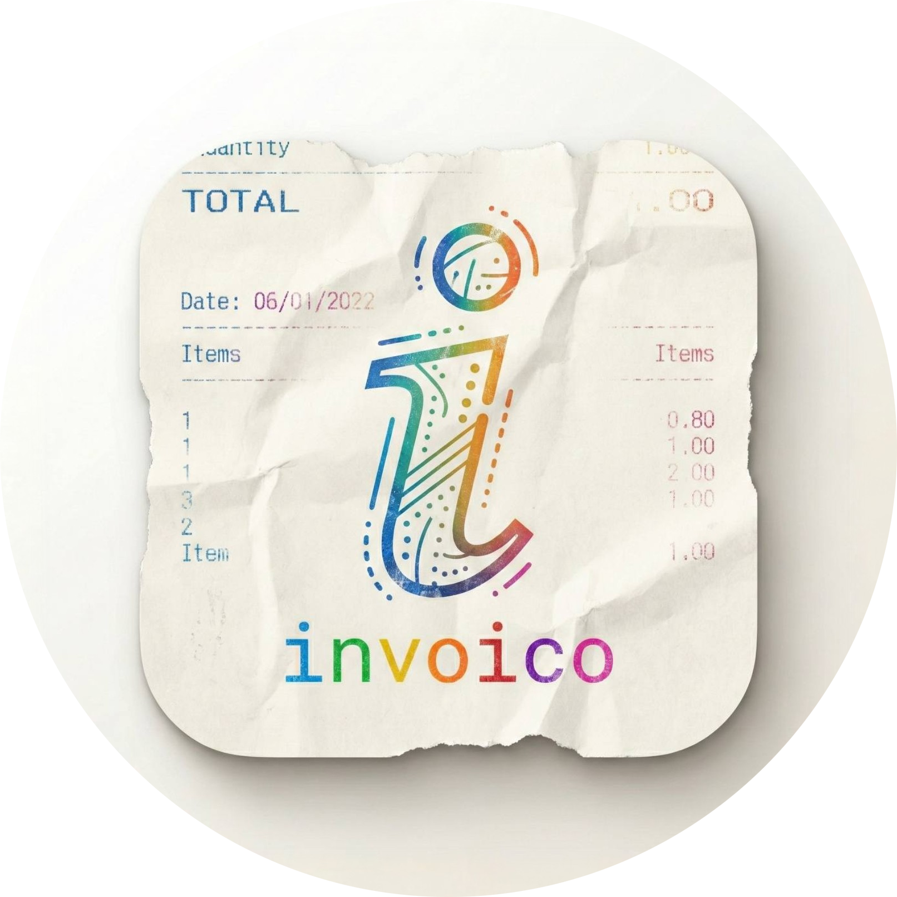
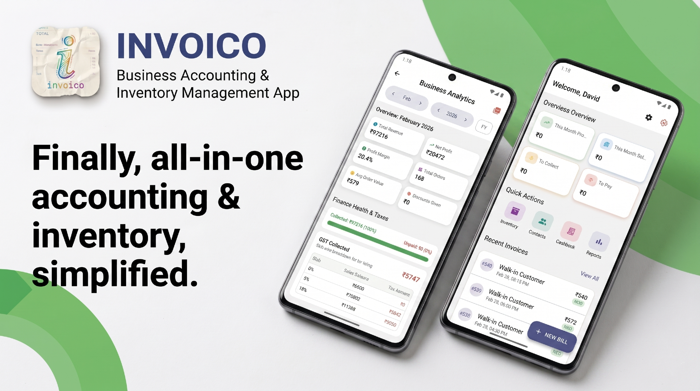
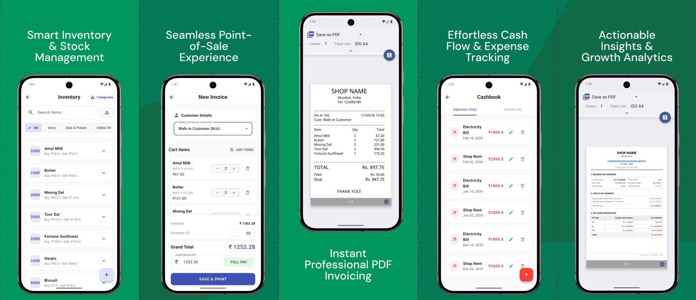

<div align="center">
  <h1>Invoico</h1>
  
  <br />
  <br />
  <a href="https://github.com/neo999in/invoico/releases">
    
  </a>
</div>

---

### 📖 Description


A professional and efficient invoice management and inventory tracking system designed for small to medium businesses. Manage your sales, customers, and stock all in one place with a clean, modern interface.

### 📸 Screenshots
<div align="center">
  
</div>

---

### ✨ Features
- 📊 **Dashboard**: Real-time overview of your business performance and key metrics.
- 📄 **Invoice Management**: Create, manage, and generate professional PDF invoices instantly.
- 📦 **Inventory Tracking**: Comprehensive stock management with category grouping.
- 👥 **Customer & Contact Management**: Centralized database for clients and suppliers.
- 💰 **Finance Management**: Record and monitor all income and expenses.
- 📅 **Detailed Reports**: Generate daily, weekly, or monthly sales and financial reports.
- 📱 **Cross-Platform**: Seamless experience on Android, iOS, and Web.
- 🔐 **Local Persistence**: Fast and secure offline data storage using SQLite.

---

### 🛠 Requirements
Before you begin, ensure you have met the following requirements:
* **Flutter SDK**: `^3.10.4` or higher.
* **Dart SDK**: Compatible with the Flutter version.
* **IDE**: [Android Studio](https://developer.android.com/studio) or [VS Code](https://code.visualstudio.com/) with Flutter/Dart plugins.
* **Platform**: 
    - **Android**: SDK 21 (Android 5.0) or higher.
    - **Physical Device** or **Emulator/Simulator** for testing.

---

### 🛠 Tech Stack
<a href="https://flutter.dev/"></a>
<a href="https://dart.dev/"></a>
<a href="https://sqlite.org/"></a>
<br clear="left"/>

- **Key Packages**:
  - `pdf` & `printing` (Document Generation)
  - `intl` (Formatting & Localization)
  - `path_provider` (Local Storage)

---

### 💻 Run Locally
1. Clone the repository:
```bash
git clone https://github.com/neo999in/invoico.git
```
2. Navigate to project directory:
```bash
cd invoico
```
3. Run the application:
```bash
flutter pub get
flutter run
```
